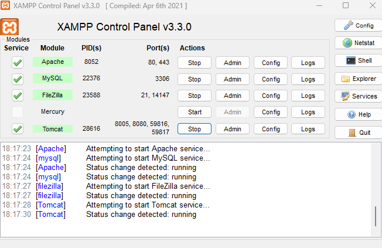

# Usage

- Clone this repository from the github

## Backend

- Open xampp control panel and make sure that apache, mysql,filezilla and tomcat are on like in this screenshot below
  
- After that, go to `backend` directory
  ```
  cd backend
  ```
- Run the following command:
  ```
  npm install
  ```
- Fill the data configuration in `.env.sample` file and rename it to `.env` file
- Run the following command to open mysql cli in the command prompt
  ```
  mysql -u root -p
  ```
- Create a new database called `stock_mgmnt_db` manually
  ```
  CREATE DATABASE stock_mgmnt_db;
  ```
- Go to `backend` directory in the project directory and run the following command
  ```
  npm run dev
  ```
- All tables are created from sequelize like this output
  ```
  The server is listening on 3000
  Connection has been established successfully.
  Table 'stockledgers' created successfully
  Table 'items' created successfully
  Table 'stockentries' created successfully
  Table 'stockentrydetails' created successfully
  Table 'batchitems' created successfully
  ```
- Run the queries below
  ```
    INSERT INTO items (item_code, name, uom)
    VALUES
    ('010101001', 'Cable Tie', 'METER'),
    ('010102001', 'Bolt', 'EACH'),
    ('010103001', 'Pin', 'PCS');
  ```
  ```
  INSERT INTO batchitems
  (batch_id, item_code, expiry_date)
  VALUES
  ('010101001001', '010101001', '2025/01/01'),
  ('010101001002', '010101001', '2025/03/01'),
  ('010102001001', '010102001', '2025/02/10'),
  ('010102001002', '010102001', '2025/04/15'),
  ('010102001003', '010102001', '2025/05/10'),
  ('010103001001', '010103001', '2025/04/15');
  ```
  ```
  INSERT INTO stockentries (entry_id, tanggal, type)
  VALUES
  ('SE001', '2024/11/05', 'IN'),
  ('SE002', '2024/11/10', 'OUT');
  ```
  ```
  INSERT INTO stockentrydetails (entry_id, item_code, batch_id, expiry_date, qty)
  VALUES
  ('SE001', '010101001', '010101001001', '2025/01/01', 30),
  ('SE001', '010101001', '010101001002', '2025/03/01', 60),
  ('SE001', '010102001', '010102001001', '2025/02/10', 40),
  ('SE001', '010102001', '010102001002', '2025/04/15', 30),
  ('SE001', '010102001', '010102001003', '2025/05/10', 40),
  ('SE001', '010103001', '010103001001', '2025/04/15', 70),
  ('SE002', '010101001', '010101001001', '2025/01/01', 10),
  ('SE002', '010102001', '010102001001', '10/02/2025', 15);
  ```
  ```
  INSERT INTO stockledgers (item_code, batch_id, tanggal, last_stock, qty_in, qty_out)
  VALUES
  ('010101001', '010101001001', '2024/11/05', 0, 30, 0),
  ('010101001', '010101001002', '2024/11/05', 0, 60, 0),
  ('010102001', '010102001001', '2024/11/05', 0, 40, 0),
  ('010102001', '010102001002', '2024/11/05', 0, 30, 0),
  ('010102001', '010102001003', '2024/11/05', 0, 40, 0),
  ('010103001', '010103001001', '2024/11/05', 0, 70, 0),
  ('010101001', '010101001001', '2024/11/10', 30, 0, 10),
  ('010102001', '010102001001', '2024/11/10', 40, 0, 15);
  ```
- After that run the following command to test API calls using Postman
  ```
  npm run dev
  ```

## Frontend

- Go back to `frontend` directory
  ```
  cd ..
  cd frontend
  ```
- Run the following command to initialize the dependencies
  ```
  npm install
  ```
- Run the following command to test the website
  ```
  npm run dev
  ```
- Open the link address http://localhost:5173/ in the address bar for the browser

## To run both (backend and frontend)

- Go back to the root directory
  ```
  cd ..
  ```
- Run the following command to initialize the dependencies
  ```
  npm install
  ```
- After the initialization of the dependencies, run the following command
  ```
  npm run web:dev
  ```
- Both backend and frontend are gonna be running locally
